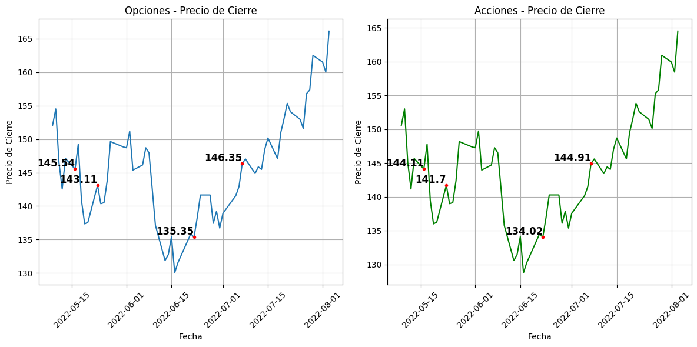
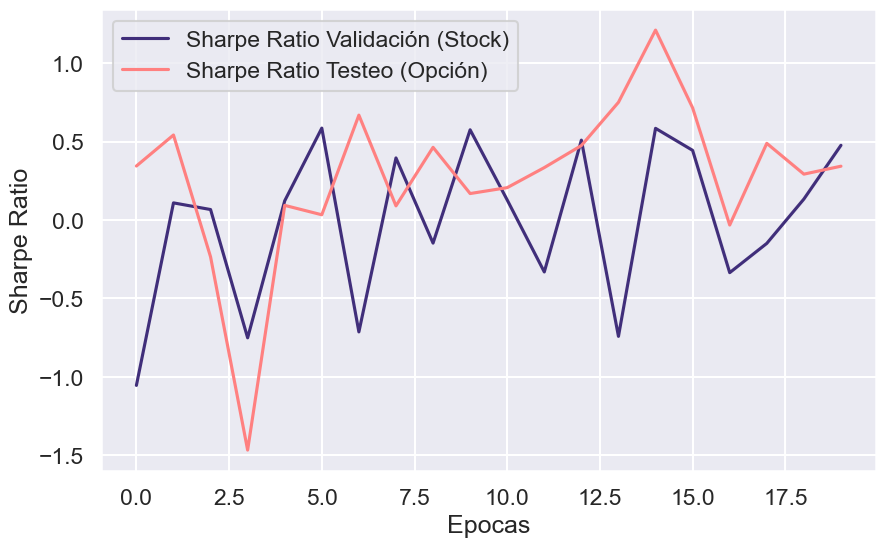
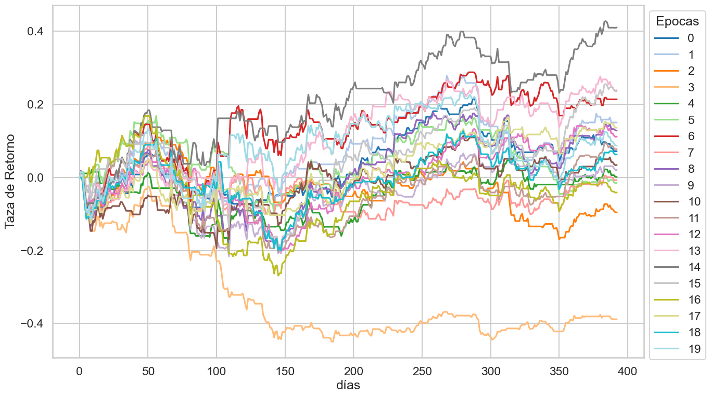
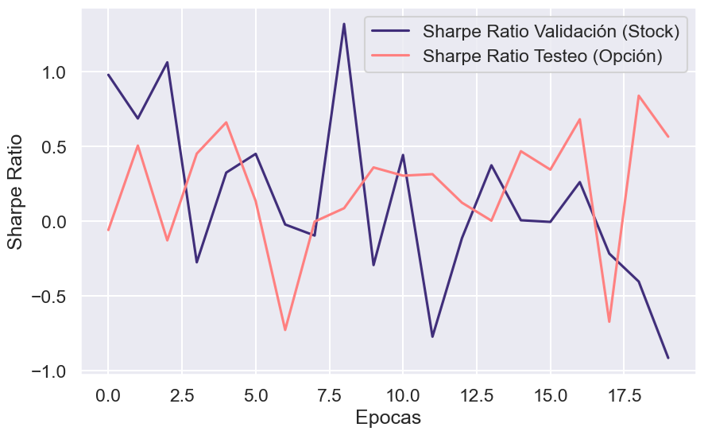
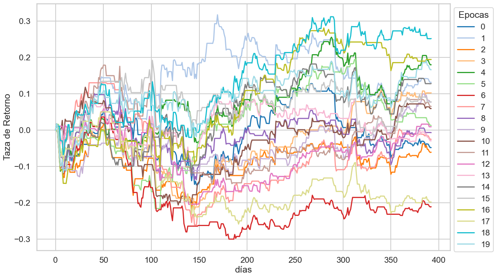
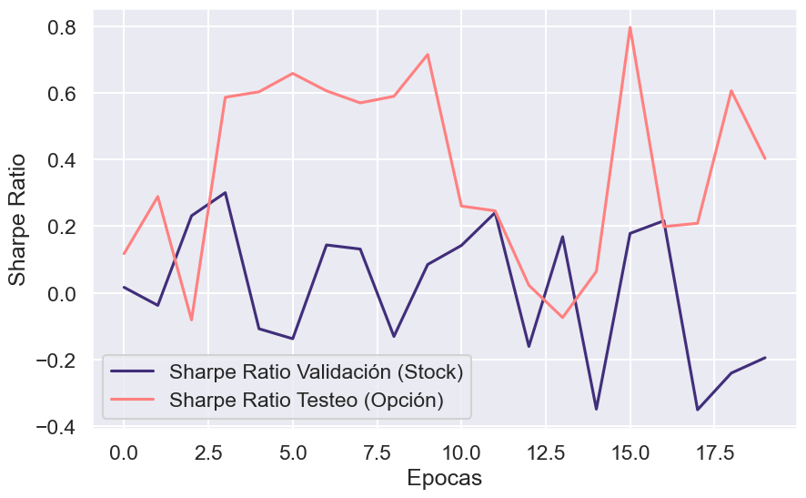
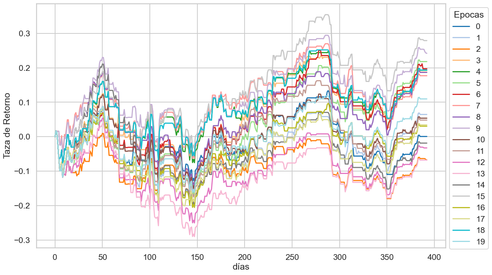

# Reinforcement Learning for American Options Trading

## Overview and Motivation

Financial options are contracts that grant the right, but not the obligation, to buy or sell an underlying asset at a predefined price (strike) within a specific time frame. In particular, American options, which can be exercised at any time before expiration, present significant challenges for pricing and trading due to their flexibility and complexity.

This project explores the use of Reinforcement Learning (RL) for automated options trading. Traditional option pricing methods (e.g., Black–Scholes, binomial trees) struggle to fully capture the dynamic nature of American options, making RL a suitable alternative due to its ability to learn decision-making policies through interaction with the environment.

A key challenge in applying RL to options trading is the lack of robust training datasets, as options contracts have short lifespans and high variability. To address this, the agents in this project are trained using historical data from the underlying asset rather than direct option prices. Prior research shows strong similarities between the behavior of the underlying asset and its options, enabling more stable and scalable training.



The main objective is to identify and evaluate the most effective RL algorithm for automated options trading, assessing performance using financial metrics such as return and risk-adjusted measures.


## Objectives

* Design a realistic RL trading environment for stocks and options
* Implement and compare **DQN (value-based)**, **PPO (policy-based)**, and **A2C (actor–critic)** algorithms
* Evaluate performance using **Sharpe Ratio** and **Return on Investment (ROI)**
* Analyze ethical implications of AI-driven trading systems

----

## 🧠 Reinforcement Learning Environment

### Environment

The agent interacts with an environment built from historical **stock and options data**, split into three datasets:

* **Training set**:
  AAPL stock data from **2002-01-02 to 2022-07-06**

  * 5,143 samples (~92%)

* **Evaluation set**:
  AAPL stock data from **2022-07-06 to 2024-04-30**

  * 477 samples (~8%)

* **Validation set**:
  American option data on AAPL from **2022-07-06 to 2023-12-29**

  * 395 samples

Each dataset includes:

* Open, High, Low, Close prices
* Trading volume

All features are **min–max scaled** to improve training stability and convergence:

```math
x_{scaled} = \frac{x - \min(x)}{\max(x) - \min(x)}
```

---

### State Representation

The state is defined as the **relative rate of change** between future and historical values using a **5-day rolling window**.

```math
State = \frac{Future}{Historical + 1e^{-5}} - 1
```

* Positive values indicate upward movement
* Negative values indicate downward movement
* Values near zero indicate relative stability

---

### Agent

The agent learns an optimal trading policy by interacting with the environment and maximizing cumulative rewards. Three Reinforcement Learning algorithms are evaluated:

* **DQN** — Value-based
* **PPO** — Policy-based
* **A2C** — Actor–Critic

#### Deep Q-Network (DQN)

Uses a deep neural network to approximate the Q-value function. Training is stabilized using:

* Experience replay buffer
* Target network

#### Proximal Policy Optimization (PPO)

A policy-gradient method that updates policies using **clipped objective functions**, preventing overly large policy updates and ensuring stable learning.

#### Advantage Actor-Critic (A2C)

Combines:

* **Actor**: selects actions
* **Critic**: evaluates actions using the advantage function

Parallel agents are synchronized to improve learning efficiency.

---

### Action Space

The action space is **discrete**:

| Action | Description |
| ------ | ----------- |
| 0      | Hold        |
| 1      | Buy         |
| 2      | Sell        |

---

### Reward Function

The reward is defined as the **relative change in total portfolio value** between consecutive time steps:

```math
AssetValue_t = Price_t \times Volume_t
```

```math
TotalValue_t = AssetValue_t + Cash_t
```

```math
Reward_t = \frac{TotalValue_t}{TotalValue_{t-1}} - 1
```

Additional adjustments:

* Incentivize **buy low / sell high**
* Penalize **consecutive actions** to reduce overtrading

---

### Performance Metric — Sharpe Ratio

Performance is evaluated using the **Sharpe Ratio**, a risk-adjusted return metric:

```math
Sharpe = \frac{R_p - R_f}{\sigma_p} \times \sqrt{252}
```

Where:

* ( R_p ) = portfolio return
* ( R_f ) = risk-free rate
* ( \sigma_p ) = return volatility


---

## 📊 Results

The **DQN, PPO, and A2C** agents were trained using the hyperparameters shown below for **200 episodes** and approximately **20 epochs**. Each model required ~**40 hours of training**, which significantly limited extensive hyperparameter tuning.

### Training Summary

* Episodes: **200**
* Epochs: **~20**
* Training time per model: **~40 hours**
* Evaluation metrics: **Sharpe Ratio** and **ROI**

### Sharpe Ratio Behavior

Across training episodes, none of the models showed a clear upward trend in Sharpe Ratio:

* **DQN**: ~0.4 – 0.6 (high variability)
* **PPO**: ~0.4 – 0.5 (moderate variability)
* **A2C**: ~0.3 – 0.4 (lower variability)

DQN exhibited the highest dispersion, indicating unstable performance across episodes.

---

## 📈 Performance Evaluation

### Validation (Stock Data)

| Model | Sharpe Ratio | ROI      | Observations                        |
| ----- | ------------ | -------- | ----------------------------------- |
| DQN   | ≈ 0          | Negative | Very low risk-adjusted performance  |
| PPO   | Positive     | Positive | Best overall validation performance |
| A2C   | Negative     | Negative | Poor risk-adjusted returns          |

### Testing (Options Data)

* **PPO** achieved the best overall performance in both **Sharpe Ratio** and **ROI**
* **DQN** showed improvement compared to stock validation but remained highly volatile
* **A2C**, despite weak absolute performance, improved relative to its validation results

All models exhibited **high standard deviation**, indicating strong variability in outcomes.

---

## 🧪 Trading Behavior Analysis

Analysis of buy/sell (or call/put) signals revealed that:

* **PPO** learned a more **conservative and stable policy**
* Reduced excessive speculation during volatile periods
* Smoother return curves with fewer abrupt spikes

This suggests PPO is better suited for environments with high uncertainty, such as options markets.







---

## 💬 Discussion

The lack of clear performance improvement suggests the models were trained in a **local minimum regime**. Prior studies report using **millions of episodes**, whereas this work was limited to 200 due to computational constraints.

Key observations:

* Longer training is likely required for meaningful convergence
* Hyperparameter optimization (e.g., Bayesian optimization) could significantly improve results
* **PPO** demonstrated superior adaptability due to its clipped policy updates, ensuring stable learning
* **DQN** suffered from high volatility due to unstable value estimation
* **A2C** showed better stability than DQN but weaker overall performance

Models performed **better on options data than stock data**, likely because option prices encode richer market information (volatility expectations, leverage, sentiment).

---

## ✅ Conclusions

* Reinforcement Learning agents were successfully implemented for **American options trading**
* Training was performed using **historical stock data**, enabling longer and more stable datasets
* Among evaluated algorithms (**DQN, PPO, A2C**), **PPO showed the strongest potential**
* PPO learned a **prudent trading strategy**, maintaining stable returns and avoiding excessive speculation
* Results suggest that **policy-based methods are better suited** for dynamic and high-risk financial environments like options trading


---

### 🤝 Contributing & Feedback

This project is a work in progress, and **community feedback is highly encouraged**.
If you have ideas, suggestions, or alternative approaches related to:

* Longer training strategies
* Hyperparameter optimization techniques
* Multi-asset or multi-option trading setups

feel free to **open an issue, start a discussion, or submit a pull request**.
Any insights, critiques, or improvements are more than welcome!


